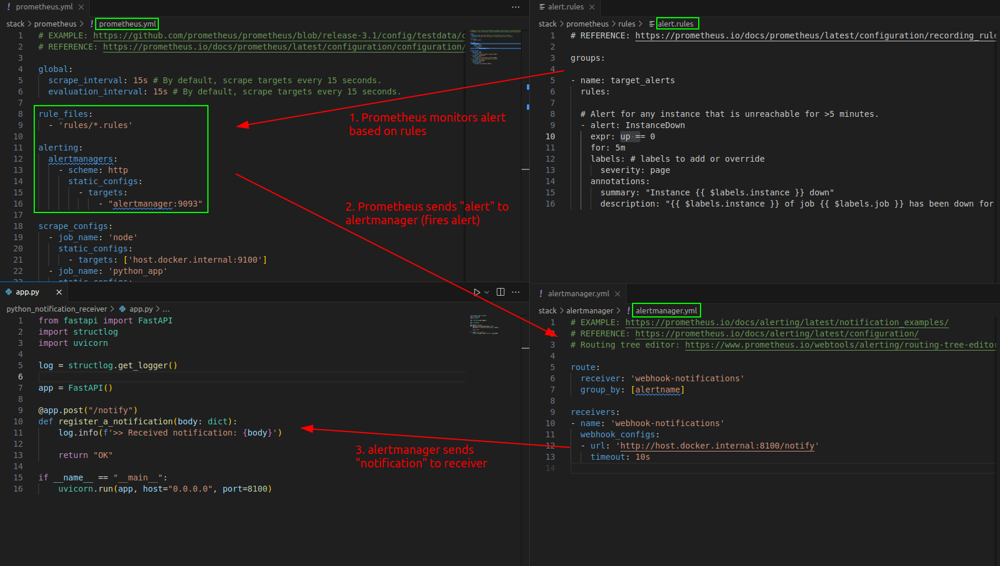

# Prometheus With Grafana Example
A minimum example of observability monitoring system with Prometheus and Grafana.

## Quick Start
System Requirements:
- Linux OS (tested with `Ubuntu 20.04.6`)
- docker (tested with version: `23.0.3`)
- docker-compose (tested with version: `1.29.2`)
- internet connection (for pulling docker images)

Steps:
1. `bash start.sh`: bring up the whole stack
2. Grafana UI can be accessed by `localhost:3000` (user: admin | password: admin)
3. `bash stop.sh`: bring down the whole stack

## Overview

*This diagram has been reworked based on architecture diagram of Prometheus ([Prometheus official introduction](https://prometheus.io/docs/introduction/overview/#architecture)).*

## Network Port Usage
<table>
    <thead>
        <tr>
            <th>Component</th>
            <th>TCP Port</th>
            <th>Share Host Network?</th>
            <th>Note</th>
        </tr>
    </thead>
    <tbody>
        <tr>
            <td>Python metric generator</td>
            <td>8000</td>
            <td>Yes</td>
            <td>Run with **python3 python_app/app_with_matrics.py**</td>
        </tr>
        <tr>
            <td>Python notification receiver</td>
            <td>8100</td>
            <td>Yes</td>
            <td>Run with **python3 python_notification_receiver/app.py**</td>
        </tr>
        <tr>
            <td>node-exporter</td>
            <td>9100</td>
            <td>Yes</td>
            <td>Includes host network interfaces in metrics</td>
        </tr>
        <tr>
            <td>prometheus</td>
            <td>9090</td>
            <td>No</td>
            <td>N/A</td>
        </tr>
        <tr>
            <td>alertmanager</td>
            <td>9093</td>
            <td>No</td>
            <td>N/A</td>
        </tr>
        <tr>
            <td>grafana</td>
            <td>3000</td>
            <td>No</td>
            <td>Forwards port 3000 to host (for UI access)</td>
        </tr>
        <tr>
            <td>loki</td>
            <td>3100</td>
            <td>No</td>
            <td>Used as Grafana alert history storage here</td>
        </tr>
    </tbody>
</table>

## Knowledge Points
- In terms of software observability, there are four commonly used tools
    1. Metrics (=indices, ex. Request Per Second)
    2. Log (=known issues printed by developer)
    3. Traces (=request processing path)
    4. Profile (=stacktraces)
- **Prometheus** is a metrics collection system (stores data in Time Series DataBase, TSDB) written in Go.
    - It takes 2 kinds of rules file
        - `altering` rules: to trigger alerts
        - `recording` rules: to precompute frequently needed expressions (stores result as a new set of time series)
    - Metric name must match `[a-zA-Z_:][a-zA-Z0-9_:]*` (`:` is reserved for user-defined recording rules)
    - Metric label name must match `[a-zA-Z_][a-zA-Z0-9_]*` (beginning with `__`, two `_`, is reserved for internal use)
    - Metric label value may contain any Unicode characters
- **Grafana** is a data visualization UI.
    - It has its own altering system which can have alert conditions **based on different datasources** (ex. Prometheus + Loki)
    - Alert rules are separated to two types,
        - Grafana-managed: Grafana handles alert monitoring and  notification sending (can **be integrated to dashboards**).
        - datasource-managed: display-only.
    - Recording rules are also supported.
- **PromQL** is a query language for Prometheus.
- **Loki** is a log aggregation system.
- **LogQL** is a query language for Loki.
- **Alertmanager** receives alerts (generated by `alerting` rules) from Prometheus and sends notifications (after grouping, inhibition, silencing) to receivers (ex. discord, email, jira, slack, telegram...).

## Prometheus Metric Types
There are 4 metric types in Prometheus (currently only used in client library, server flattens all data into untyped time series data).
1. Counter
    - a value which can only be increased or be reset to 0 on restart (ex. total number of requests).
2. Gauge
    - a value which can go up and down (ex. the number of concurrent requests).
3. Histogram
    - aggregation (from different instances) possible with PromQL.
    - quantile (ex. 0.95-quantile means 95th percentile) is calculated on server with `histogram_quantile()` PromQL function.
    - exposes the following extra metrics/labels,
    ```bash
    <metric_basename>_bucket{le="<upper inclusive bound>"}
    <metric_basename>_sum
    <metric_basename>_count
    ```
4. Summary
    - hard to aggregate (from different instances) cause quantile calculation happens on client.
    - quantile (ex. 0.95-quantile means 95th percentile) is pre-calculated on client (requires reconfiguring client when quantile value changes).
    - exposes the following extra metrics/labels,
    ```bash
    <metric_basename>{quantile="<φ>"}
    <metric_basename>_sum
    <metric_basename>_count
    ```

## Prometheus Default Metrics And Labels
- While scraping a target, the following labels are automatically added to identify the scraped target,
    - `job`: the **job_name** configured in `prometheus.yml`
    - `instance`: the `<host>:<port>` part of the target (one of the **targets** described in `prometheus.yml` under a **job_name**).
- For each target scrape, Prometheus stores a sample in the following metrics,
    - `up{job="<job-name>", instance="<instance-id>"}`: `1` mean healthy, `0` means scrape failed.
    - `scrape_duration_seconds{job="<job-name>", instance="<instance-id>"}`
    - `scrape_samples_post_metric_relabeling{job="<job-name>", instance="<instance-id>"}`
    - `scrape_samples_scraped{job="<job-name>", instance="<instance-id>"}`
    - `scrape_series_added{job="<job-name>", instance="<instance-id>"}`

## PromQL Syntax
```bash
# get data of a metric filtered by labels
<metric name>{<label name>=<label value>, ...}
# call a function with a metric within a time range, ex. 5m
<function name>(<metric name>[<time range>])
```

## Backup & Restore Prometheus TSDB
Currently there is no UI for this function. However, to achieve this, we can
1. Create snapshot of the TSDB via admin API
```bash
# find prometheus container IP
docker inspect prometheus

# trigger Prometheus admin API for snapshot (needs --web.enable-admin-api flag to be set)
curl -XPOST http://<prometheus_container_IP>:9090/api/v1/admin/tsdb/snapshot

# the admin API will create snapshot of current TSDB under data folder (for example, in our case: ./prometheus_runtime_data/snapshots/20250117T054020Z-3f530cc0f386edcf)
```
2. Manually copy (need `sudo`) folders under snapshot to Prometheus data folder (in our case: `prometheus_runtime_data` folder)

3. Start Prometheus

**NOTE**
- Restored TSDB is under governance of retention policies of the Prometheus instance restores it.
- Snapshot uses almost **the same disk space** as the TSDB being snapshot, remember to delete it after copying.

## Grafana Data Persistence
During runtime, Grafana stores data (configurations of datasources, dashboards...) to databases. To persist its data locally, one should do the followings (which is called **provision**),
```bash
# provision "dashboard"
1. Export dashboard JSON file (without sharing externally)
2. Put the JSON file under ./grafana/provisioning/dashboards
3. Restart Grafana (or wait for the value of {updateIntervalSeconds})

# provision "datasource"
1. Add datasource in ./grafana/provisioning/datasources/datasources.yaml
2. Restart Grafana
```
A good starting point: [Provisioning Grafana tutorial (in Chinese)](https://ithelp.ithome.com.tw/m/articles/10295816)

## Prometheus & Alertmanager - Configurations
A configuration example to pipe alerts generated by alert rules in `Prometheus` to notifications received by `python_notification_receiver` via `Alertmanager`.


## Disk Usage Concerns
1. **Grafana**
    - datasource caching (per datasource)
    - dashboard version history (`versions_to_keep` in `grafana.ini`, comment out by default)
2. **Prometheus**
    - Retention policies of the TSDB: `time` or `size` (only one can be active).
        - when `time` is used, all samples in the oldest 2 hours must be out of the retention time to trigger deletion.
        - when `size` is used, the oldest 2-hours samples are deleted when retention size is reached (it is recommended to use 80-85% of the allocated disk space).
        
    - Data compaction happens every 2 hours, by default.
3. **Loki**
    - Currently only supports retention based on `time`.

4. **Docker Container**
    - default log driver does not do log rotation

## Fine-tuned Items
- [x] Running `node-exporter` in host mode (so it can access all host Network Interfaces)
- [x] Docker container log auto-rotation (logging driver: local)
- [x] DB `size` limitation of Prometheus (1GB)
- [x] DB `time` limitation of Loki (168h)
- [x] Persistent Grafana data (so it becomes portable)
- [x] Bind out Prometheus data (in `prometheus_runtime_data` folder)
- [x] Bind out Loki data (in `loki_runtime_data` folder)

## Handy Commands
```bash
# reload Prometheus configuration without restarting it
docker exec -it prometheus kill -HUP 1
# list all docker containers brought up by this project
docker ps --filter "label=observability_stack"
# list all docker containers responsible for "visualization"
docker ps --filter "label=observability_stack=visualization"
# list all docker containers act as "datasource"
docker ps --filter "label=observability_stack=datasource"
# list all docker containers act as "exporter"
docker ps --filter "label=observability_stack=exporter"
```

## References
- Grafana
    - [Grafana - datasource caching](https://grafana.com/docs/grafana/latest/administration/data-source-management/#query-and-resource-caching)
    - [Grafana - dashboard version_to_keep setting](https://grafana.com/docs/grafana/latest/setup-grafana/configure-grafana/#dashboards)
    - [Provision Grafana](https://grafana.com/docs/grafana/latest/administration/provisioning/)
    - [Provisioning Grafana example](https://github.com/grafana/provisioning-alerting-examples/tree/main/config-files/grafana/provisioning)
    - [Enable alert history board](https://grafana.com/docs/grafana/latest/alerting/set-up/configure-alert-state-history/)
    - [Display alerts on dashboards (heart icon)](https://www.youtube.com/watch?v=ClLp-iSoaSY)
- Prometheus
    - [Prometheus metric types](https://prometheus.io/docs/concepts/metric_types/#metric-types)
    - [Histogram V.S. Summary](https://prometheus.io/docs/practices/histograms/)
    - [Jobs and Instances](https://prometheus.io/docs/concepts/jobs_instances/)
    - [Prometheus storage](https://prometheus.io/docs/prometheus/latest/storage/)
    - [Admin API - snapshot](https://prometheus.io/docs/prometheus/latest/querying/api/#tsdb-admin-apis)
    - [stack overflow - prometheus DB backup and restore](https://stackoverflow.com/questions/67608379/backup-and-restore-prometheus-metrics)
- Alertmanager
    - [Grouping, Inhibition, Silencing](https://prometheus.io/docs/alerting/latest/alertmanager/)
    - [Supported notification receivers](https://prometheus.io/docs/alerting/latest/configuration/#general-receiver-related-settings)
- Loki
    - [Promtail for loki (in Chinese)](https://ithelp.ithome.com.tw/articles/10331661)
    - [LogQL](https://grafana.com/docs/loki/latest/query/)
